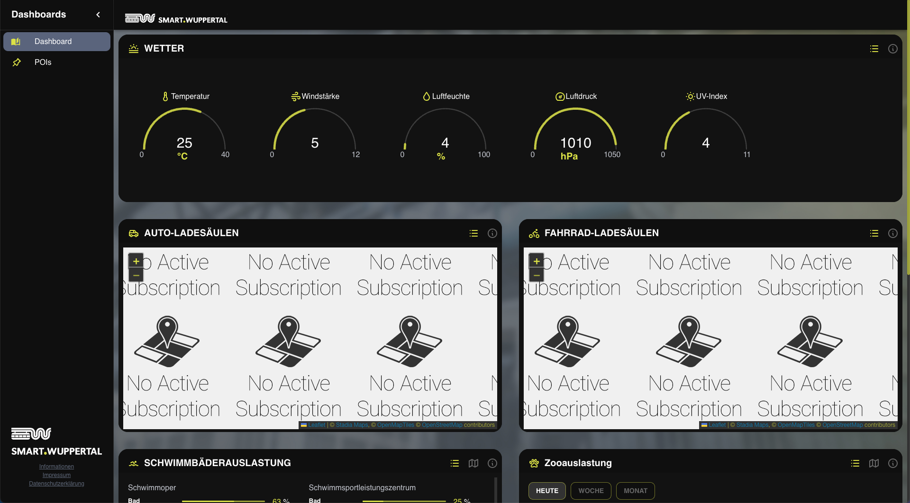

- #Feature
- 
- On a higher level than the dashboards the following features exist
	- [[Header]]
	- [[Side Menu]]
	- [[Localization]]
	- [[Theming]]
	- [[Additional pages]]
- The basic structure of Dashboards is the following
	- **Dashboard**: Each Dashboard has it's own url (e.g.: `/dashboards/weather`) and can be access restricted as well as hidden or shown to the public
		- **Widget**: Dashboards contain widgets (or Panels directly, skipping the Widget) which have a title and can contain additional features (such as having an icon, having toggles to show different content, etc.). Their size and placement inside of the dashboard they belong to can be modified
			- **Panels**: Inside of each Dashboard or Widget it's possible to have multiple Panels. The Panels are the components which contain the content (e.g. they might contain charts from the [[Charting package]] , or a map from the [[Map package]])
			  id:: 640848b7-75b5-41c0-b473-8e5cbe5acd54
- The Dashboards and their contents can be configured in live operation, making it very convenient for all users, as the application does not have to be rebuilt and redeployed for changes to take effect. Through smart usage of concepts such as [[Incremental Static Regeneration]], the content management nevertheless comes with the best possible performance that web technology has to offer
- Through [[Structure Versioning]] new versions of Dashboards and Dashboard components can be modified and released without having to worry about the existing instances
- The UI part of all components shall be developed using [[Storybook]] to make them as functionally independent, tested and well documented as possible